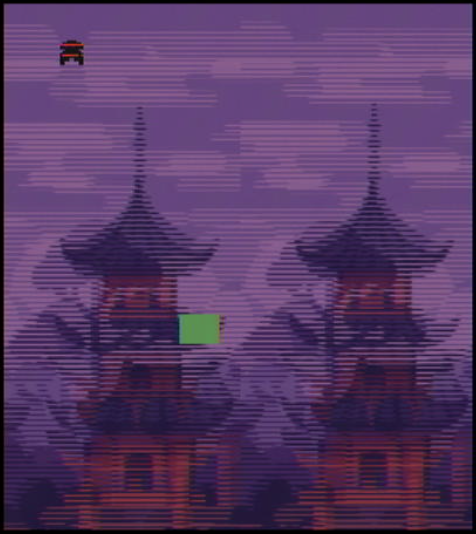
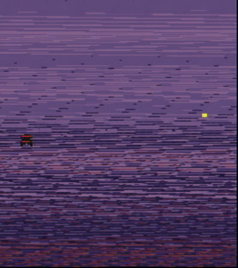

# 2-D-shooter-FPGA

# Ninja Showdown: An FPGA-Based VGA Game

A 2D pixel-art ninja adventure game built entirely in SystemVerilog for the DE1-SoC FPGA board. Players battle monsters and a shape-shifting final boss while navigating different maps rendered in VGA graphics.

## 🥷 Game Overview

You are a lone ninja defending your village from monstrous enemies who distort reality. The game spans two key levels:

- **Level 1 – The Dojo:** Face the elusive ghoul *Roko*, who shifts unpredictably and can haze your vision. Defeating Roko is optional—but satisfying.
- **Level 2 – The Final Fight:** Enter the domain of *Radden*, the final boss who goes invisible, distorts colors, and fires deadly missiles from his spaceship. One hit from a missile and it's game over.

Power up. Navigate. Survive. Win.

## 🎮 Features

- **Character Control:** Move the ninja using on-board pushbuttons; platformer-style movement with gravity and jump logic.
- **Bullet System:** Fire shuriken-style bullets. Collision detection is implemented for ghoul and boss damage.
- **Boss AI:** Radden moves dynamically, changes color to distract, and becomes briefly invisible. Hit his core 3 times to win.
- **7-Segment Display:** Shows WIN/LOSE messages and boss health live.
- **Map ROMs:** Two separate `.mif` files store pixel-art map layouts for each level.
- **Pixel Rendering Engine:** VGA-compatible rendering with sprite and background compositing.
- **Modular SystemVerilog Design:** Code is cleanly modularized for clarity and scalability.

## 🧠 Architecture

DE1_SoC.sv
│
├── character_rend.sv # Renders player sprite
├── bullet.sv # Handles bullet logic and rendering
├── ghoul.sv # Enemy module with movement and hit logic
├── final_boss.sv # Boss rendering and interaction
├── boss_bullet.sv # Final boss missile attack system
├── map_selector.sv # Switches map ROMs based on game level
├── rom1port.mif # Map 1 (Dojo)
├── boss_sprite.mif # Boss image
├── *.mif # Other assets (sprites, alternate maps)
├── seg7.sv # 7-segment display driver
└── clock_divider.sv # Clock divider for gameplay timing

## 🧪 How to Run

1. **Hardware Required:**  
   - Terasic DE1-SoC FPGA Development Board  
   - VGA Monitor

2. **Tools:**  
   - Intel Quartus Prime (recommended: v20.1 or above)

3. **Steps:**  
   - Load all source files into a Quartus project.
   - Make sure `.mif` files are assigned correctly to ROM modules.
   - Synthesize and program onto the DE1-SoC.
   - Connect VGA output to a monitor and play using the pushbuttons.

## 🔧 Controls

| Control      | Action            |
|--------------|-------------------|
| KEY[0]       | Move Right        |
| KEY[1]       | Move Left         |
| KEY[2]       | Jump              |
| KEY[3]       | Fire Bullet       |
| SW[5]        | Reset Game        |
| SW[7] + SW[2]| Invincible mode   |

## 📺 Screenshots

Map 1 screenshot 

## 📂 License

This project is released under the MIT License.
